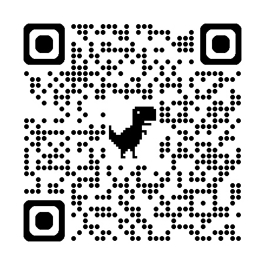

# Giới thiệu nhóm và sản phẩm

## 1. Danh sách thành viên

| STT | Mã HV | Họ tên |
| --- | --- | --- |
| 1 | 2A202600678 | Nguyễn Đăng Dương | 
| 2 | 2A202600671 | Nguyễn Đình Khải |
| 3 | 2A202600829 | Hà Xuân Huy |
| 4 | 2A202600780 | Tôn Thành Đạt | 

## 2. Mô tả ngắn sản phẩm

Food For You là prototype chatbot gợi ý món ăn cho sinh viên quanh VinUniversity. Người dùng có thể nhập nhu cầu như ngân sách, thời gian còn lại, sở thích ăn nóng, tránh cay hoặc muốn ăn nhẹ/ăn no. Hệ thống sẽ phân tích yêu cầu, lọc dữ liệu món ăn phù hợp và trả về gợi ý kèm lý do chọn món.

Sản phẩm gồm giao diện web React/Next.js, backend Express/TypeScript, mock data món ăn và tích hợp OpenAI API để hỗ trợ hiểu prompt tự nhiên hơn. Prototype tập trung vào trải nghiệm trò chuyện nhanh, trực quan và dễ demo.

## 3. Link deploy demo
Backend: https://day06-food-for-you.onrender.com
Frontend: https://day06-food-for-you.vercel.app

  

